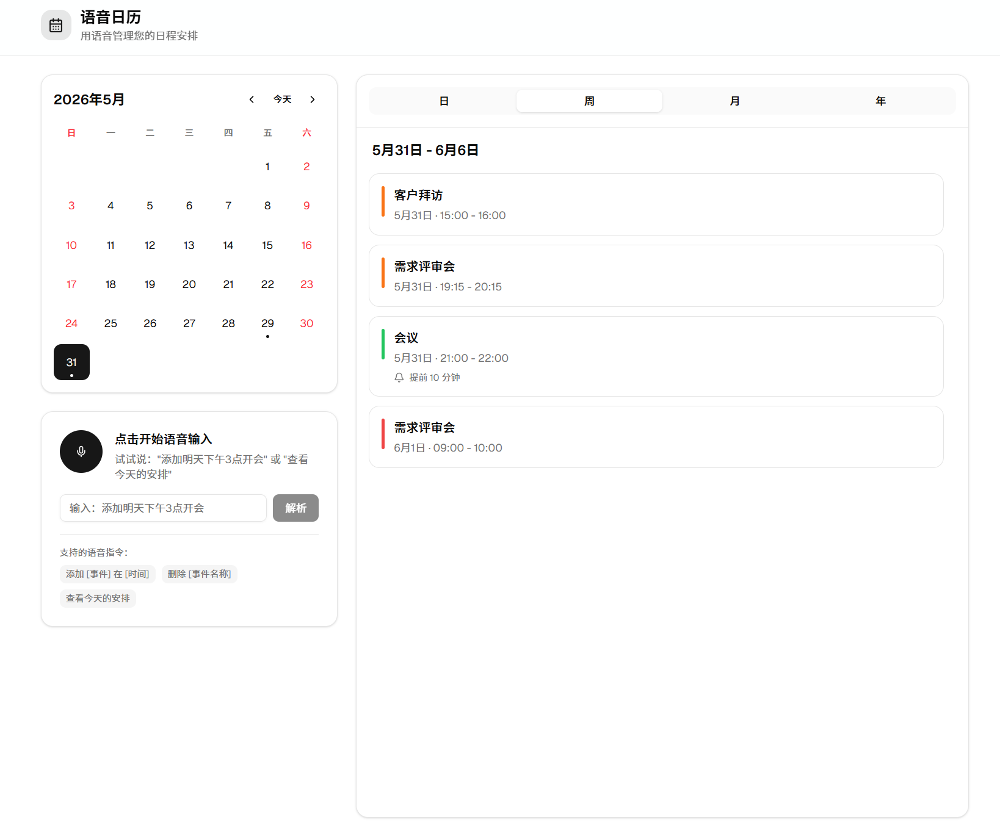

# 语音日历 — 用自然语言管理日程的智能日历工具

📺 **演示视频**：[https://www.bilibili.com/video/BV1tLVQ6cEdR/](https://www.bilibili.com/video/BV1tLVQ6cEdR/)

**语音日历** 是一款以自然语言交互为核心的网页端日历管理工具。你只需要像跟助理说话一样——说出你想安排、修改或查询的日程，系统就能自动理解并执行。不再需要逐字段填写表单，也不再需要记住精确的事件名称。

<p align="center">
  
</p>

## 核心创新

### 🎙️ 真正的自然语言交互

这不是"说出固定关键词触发操作"的语音指令系统。你可以用日常说话的方式表达：

- "添加下午五点的需求评审会，还有七点的客户见面会" → 自动拆成两个事件，依次确认
- "删除今天下午两点的会议" → 自动匹配到对应事件，不需要说出精确名称
- "把产品评审改到明天上午十点" → 自动找到原事件并修改时间
- "下周有什么安排" → 自动切换到周视图

### 🤖 LLM + 规则双引擎解析

每条自然语言指令先由 DeepSeek 大模型解析为结构化命令，如果网络异常或模型不可用，自动降级到本地规则解析器。保证演示不依赖外部服务稳定性。

### 🔊 静音自动停止录音

点击麦克风开始说话，说完停顿 2 秒自动结束录音并转写。不需要手动点击停止按钮——就像真实的对话体验。

### ⚡ 一句话多事件

"添加下午五点的评审会，还有七点的见面会" — 系统识别出两个独立事件，依次弹出确认卡片，一个接一个确认创建。

### 🛡️ 冲突检测 + 空闲时间推荐

创建事件时自动检测当天是否与已有事件时间重叠。有冲突时显示红色/黄色警告，并推荐当天首个空闲时段，一键采用。

### 🔍 按时间模糊匹配

删除或编辑事件时不需要说出精确标题。"删除今天下午两点的会议" 就会被正确匹配到对应时间的事件。

### 🎯 候选事件选择

当指令有歧义时（如"删除会议"但存在多个含"会议"的事件），自动列出所有匹配候选，点击即可操作。

### 📅 年历快速导航

点击左上角月份标题，展开全年 12 格月份视图，每个月份标注是否有事件。一键跳转到任意月份。

## 功能一览

| 功能 | 能力 |
|------|------|
| 语音添加 | 单事件、多事件，支持中文自然语言时间和提醒 |
| 语音删除 | 按标题匹配、按时间模糊匹配、候选选择 |
| 语音编辑 | 修改标题、日期、时间，"把XX改到YY" |
| 语音查询 | 今天/明天/下周/本月/今年 + 关键词搜索 |
| 视图切换 | 日 · 周 · 月 · 年四种视图 |
| 冲突检测 | 时间重叠警告 + 空闲时段推荐 |
| 事件详情 | 点击事件弹出编辑对话框，支持快捷时间调整 |
| 浏览器提醒 | 准时、提前 5-30 分钟、提前 1 小时系统通知 |
| 本地持久化 | localStorage 保存，刷新不丢失 |
| 年历导航 | 点击标题展开全年月历 |
| 文字兜底 | 语音不可用时可直接输入文字命令 |

## 技术栈

- **前端**：Next.js 16 + React 19 + TypeScript + Tailwind CSS + shadcn/ui
- **语音转写 (ASR)**：通义千问 DashScope `qwen3-asr-flash`
- **指令解析 (LLM)**：DeepSeek `deepseek-v4-flash`
- **存储**：Browser localStorage

## 本地运行

需要 Node.js 20+。

```bash
corepack pnpm install
cp .env.example .env.local   # 编辑填入 API Key
corepack pnpm dev
```

打开 `http://localhost:3000`。推荐使用 Chrome 或 Edge。

`.env.local` 配置：

```bash
# DeepSeek 指令解析
DEEPSEEK_API_KEY=你的Key
DEEPSEEK_BASE_URL=https://api.deepseek.com
DEEPSEEK_MODEL=deepseek-v4-flash

# 语音转写（推荐千问 DashScope）
ASR_API_KEY=你的Key
ASR_BASE_URL=https://dashscope.aliyuncs.com/compatible-mode/v1
ASR_MODEL=qwen3-asr-flash
```

## 演示要点

建议按以下顺序演示最能体现产品特点：

1. **多事件添加**："添加下午五点的需求评审会，还有七点的客户见面会" → 展示自动拆分 + 依次确认
2. **静音自动停止**：点击麦克风 → 说话 → 停顿 2 秒自动提交
3. **按时间删除**："删除下午两点的会议" → 展示模糊匹配能力
4. **语音编辑**："把产品评审改到明天上午十点" → 展示自动匹配 + 修改
5. **语音查询**："下周有什么安排" → 展示范围搜索 + 关键词过滤
6. **冲突检测**：在有事件的时间段添加新事件 → 展示冲突警告 + 空闲推荐
7. **年历导航**：点击月份标题 → 展示全年月历视图
